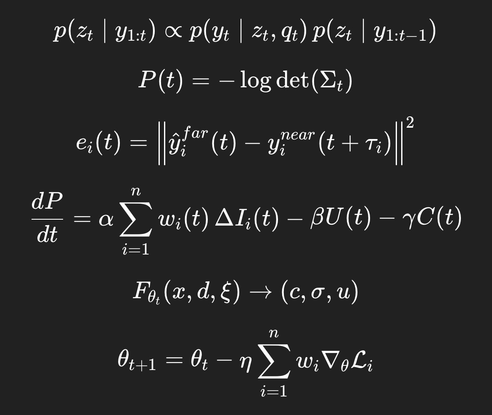

> **Neurophysiological transition analysis**

A transition-sensitive, multi-layer signal analysis framework for identifying changes in functional brain state during anesthesia that identifies changes in physiological functional states from time-series data, with direct application to anesthesia and consciousness monitoring.

The current conceptual frame is primarily neurophysiological, one of the most promising translational directions for NeuroCore is :

> *Anesthesia and pharmacologically induced transitions of consciousness*

---

### Mathematical Flow

*x(t) ∈ X*  
↓  
*x(t+1) = Φ(x(t))*  
↓  
*Γₖ ⊂ X , X = U ∪ Xₖ*  
↓  
*λ(t) = k if x(t) ∈ Γₖ*  
↓  
*z_E(t) = Europa(x(t))*  
↓  
*Φ_local(t) = Σ log(1 + |∇x(i)|)*  
↓  
*Δ(t) = |Φ(t) − Φ(t−1)|*  
↓  
*K(t) = σ / μ*  
↓  
*L(x(t)) → φ ≈ 0.55*  
↓  
*z(t) = [z_E, Δ, K, L]*  
↓  
*λ(t) = f(z(t))*

---

> **NeuroCore** is a multilayer architecture designed to partition complex dynamical systems into metastable regions and transition zones. 

Given a signal **x(t)**, we derives structural features from local dynamics:

$$\Phi(t) = \sum_{i=t-\tau}^{t} \log(1 + |\nabla x(i)|)$$

**Where:**
* **∇x(i)**: Local gradient.
* **log(1 + ⋅)**: Stabilizing compressive transform.
* **τ**: Temporal integration window.

To capture structural changes and dynamical instability, we define the **first-order temporal difference**:

$$\Delta(t) = |\Phi(t) - \Phi(t-1)|$$

**Operational Interpretation:**
* **Low Δ**: Stable regime.
* **High Δ**: Structural shift.
* **Δ Peaks**: Discrete events or state transitions.

While ARCHON focuses on local instability, NeuroCore integrates global and asymptotic metrics to provide a complete state-space representation.

### ASHI-CORE 
Uses the coefficient of variation (**K**) as a proxy order parameter to identify transitions between variability regimes:

$$K(t) = \frac{\sigma}{\mu}$$

* **Low K**: Homeostatic/Low-variability state.
* **High K**: Systemic instability.
* **Empirical Threshold**: **Kc ≈ 1.441** observed as a transition marker.

### L-Operator (Asymptotic Stability)
Defines a mapping into a stability space to identify functional stationarity:

$$\lim_{t \to \infty} L(x(t)) = \phi \approx 0.55$$

